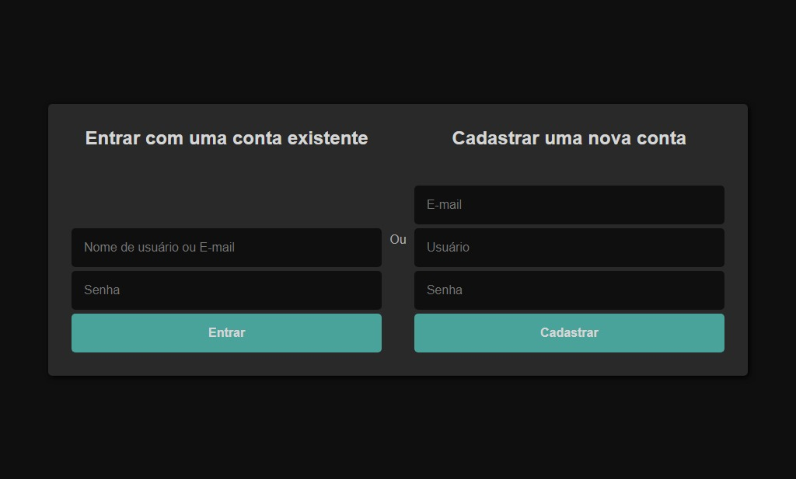
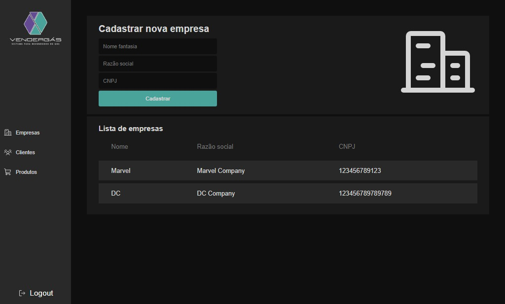
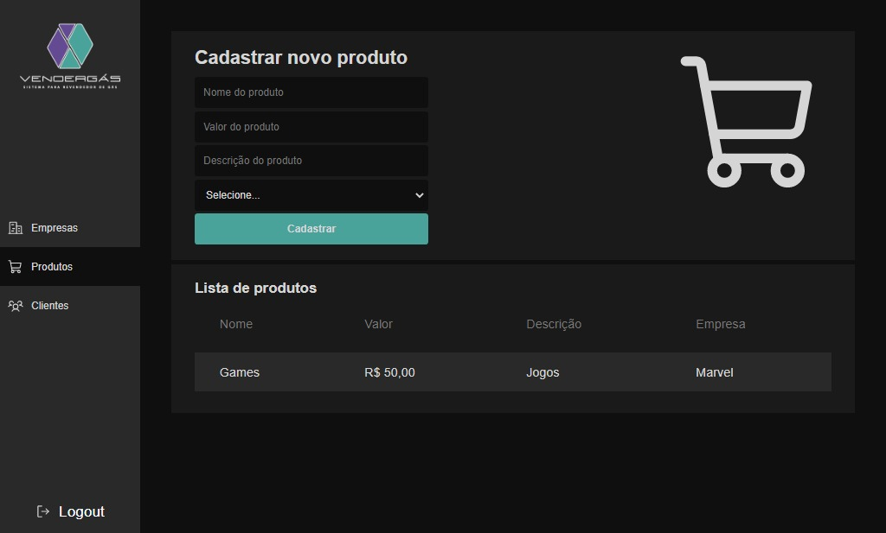
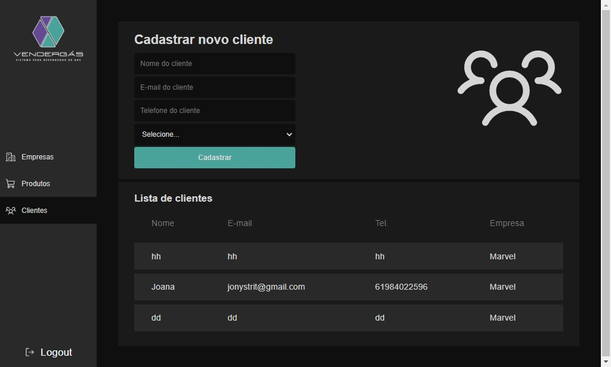
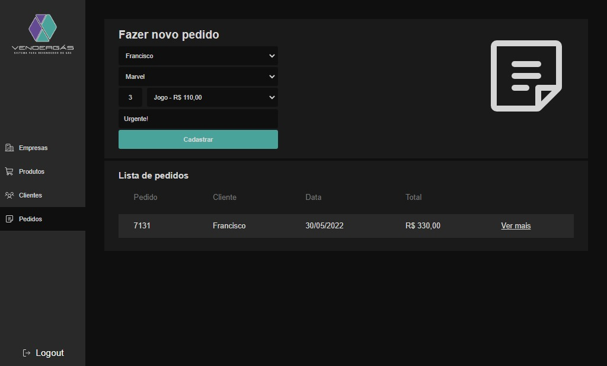
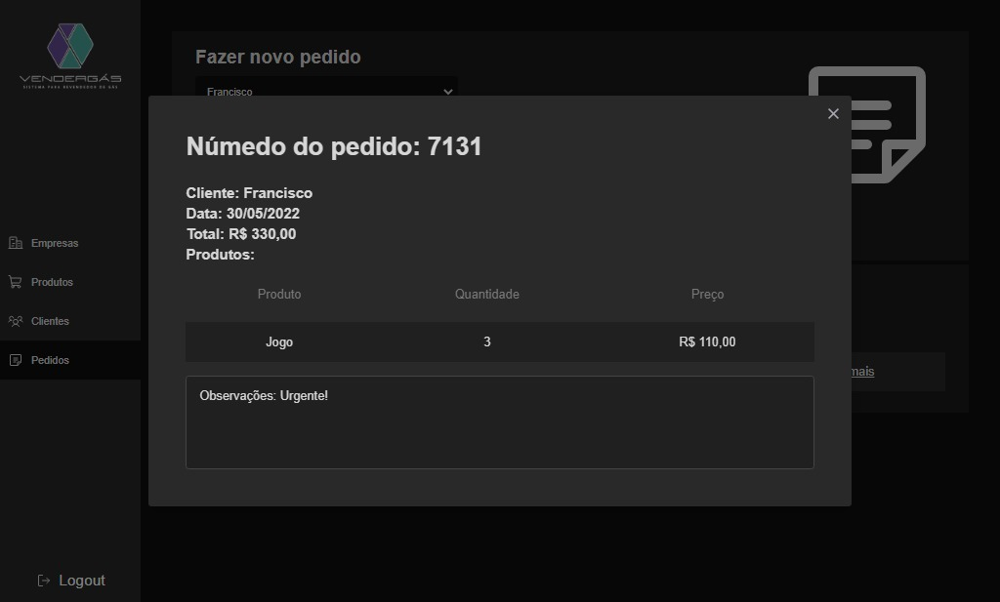

<h1 align="center"> 🖥️ DESAFIO VENDERGÁS </h1>

<h3> 💻 Sobre o projeto</h3>

Esse é uma aplicação para gerenciamento de dados de um comércio.

📝 O sistema possui as funcionalidades de:

 <li>Login e cadastro de usuário</li>
 <li>Cadastro e listagem de Clientes, Empresas e Produtos</li>
 <li>Fazer um novo pedido e listar pedidos já feitos</li>
  
 
 <h3>Front:</h3>
 <li> Criação das interfaces utilizando ReactJS (+bibliotecas) e SASS, Rotas de navegação com react router, estados globais com useContext, Axios para fazer requisições para o back-end;
 
 <h3>Back:</h3>
 <li> Criação e gerenciamento de rotas com NodeJS e Express, criação de modelos e integração com o banco de dados utilizando mongoose, senha HASH com Bcrypt, autenticação com JWT (Json Web Token) em todas as rotas. Porta do server, URL do banco de dados e PRIVATE_KEY passadas por .env ;
 <li> Banco de dados MongoDB com collection para cada modelo.
 
 <h2>🖼 Imagem da tela de login: </h2>

<h2>🖼 Imagem da tela de boas vindas: </h2>

 
 <h2>🖼 Imagem da tela de empresas: </h2>

 
 <h2>🖼 Imagem da tela de produtos: </h2>

<h2>🖼 Imagem da tela de clientes: </h2>

<h2>🖼 Imagem da tela de pedidos: </h2>

<h2>🖼 Imagem da tela de detalhes do pedido: </h2>

  

<h2>🚀 Tecnologias utilizadas: </h2>

  
  
  
  
  
  
  
  
  
  
  
  
  
  
  
  
  
  

  
  <h3>Dados passados por .ENV</h3>
  PORTA do servidor, URL do mongoDB e PRIVATE_KEY para autenticação JWT.
 

<h2>👷 Como testar? </h2>
<h3>FRONT-END: </h3>
<li> Clone o repositório com: git clone https://github.com/johnatanSO/vendergas-desafio.git
<li> Entre em uma IDE de sua preferência;
<li> Execute o 'npm install' para instalar as dependências do front-end;
<li> Execute o npm start para iniciar o servidor local;
<li> Crie uma nova conta e faça login com ela.
  
<h3>BACK-END: </h3>
<li>Entre na pasta /server; </li>
<li>Crie um container local com o arquivo Dockerfile e execute-o;</li>
<li>Ou, execute o comando 'npm install' para instalar as dependências do servidor;</li>
<li>Execute o comando 'npm start' para iniciar o servidor (será executado por padrão na porta 3000, certifique-se de que está disponível).</li>
 

<h3>Rotas:</h3>

<li> '/user/createAccount' espera um email, username e password como dados passados pela requisição, e irá retornar o usuário criado;
<li> '/user/login' espera um username ou email e password como dados passados pela requisição, e irá retornar o usuário logado e um token;
<li> '/company/createCompany' espera um fantasy name, social name e cnpj como dados passados pela requisição, e um token no header, e irá retornar o a empresa criada;
<li> '/company/listCompanies' retornará a lista de empresas;
<li> '/product/createProduct' espera um nome, valor, descrição e empresa como dados passados pela requisição, e um token no header, e irá retornar o produto criado;
<li> '/product/listProducts' retornará a lista de produtos;
<li> '/client/createClient' espera um nome, email, telefone e empresa como dados passados pela requisição, e um token no header, e irá retornar o cliente criado;
<li> '/client/listClients' retornará a lista de clientes;
<li> '/order/createOrder' espera um cliente, empresa, produtos e observação como dados passados pela requisição, e um token no header, e irá retornar o pedido criado;
<li> '/order/listOrders' retornará a lista de pedidos.
 

 <h2>🎓 Autores</h2>
 <h3>Feito com o 💜 by <a href="https://github.com/johnatanSO" target="_blank">Johnatan Santos</a></h3>

